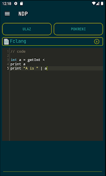
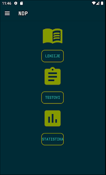
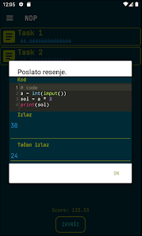
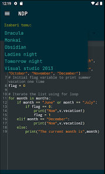

# NDP - NauciDaProgramiras
NDP is programming eLearning platform for Android. It provides everything from
classes, lectures, assignments, analytics tools, teacher moderation tools etc. to multi 
programming language support including Python, Java and Fclang.

NDP was winner app of MTS App Challenge and Regional App Challenge organized by Telekom Serbia.

**Note:** this is an open source version of NDP, which means it lacks a lot of things.
Most importantly you have to connect you own database in order to run it.
